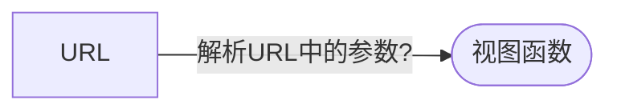
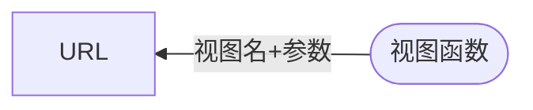
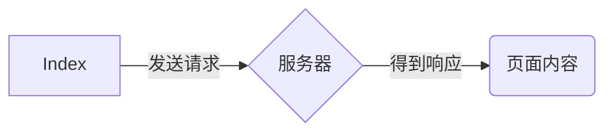
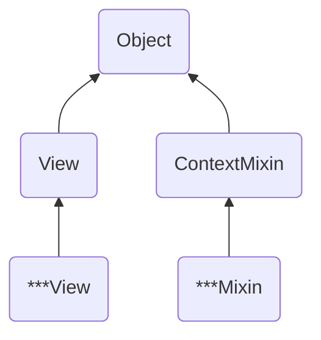

<!-- # Django入门学习教程 -->

## 开发基础

### 安装Django

1. 使用pip进行安装：
    `pip install django`
2. 源码安装：
   `>>> python setup.py install`
3. 检测安装是否成功

   ```code
   >>> import django
   >>> django.__version__
   '3.2.9'
   ```

### django项目的创建

`django-admin startproject my_project`

### 启动开发服务器

`python manage.py runserver`

#### 思考：怎么制定特定的端口？

`python manage.py runserver`

### **runserver**常用参数

`python manage.py runserver 0.0.0.0:9527`
需要在settings.py中配置 **ALLOWED_HOSTS**

### 创建模块

创建hello模块
`python manage.py startapp hello`

### 完成第一个页面

1. 在views.py中写个函数
2. 在urls.py中配置规则

> 小结

记住 `runserver`,`startapp`命令

## 从请求到响应

> 章节概要

- 从请求到响应
- 内置视图函数及重写
- 在视图函数中处理业务逻辑
- 请求响应对象
- 视图快捷方法
- 使用Class重写视图

> 本章目标

- 掌握视图函数的编写
- 掌握常见内置视图函数的使用
- 理解从请求到响应的流程
- 理解请求对象与响应对象
- 使用Class重写视图

### 从请求到响应-2

> 本节内容

- 了解URL的设计及配置
- 掌握视图的定义及作用
- 掌握URL和视图的关系
- 了解响应视图的内容

#### 什么是视图？

- 一个视图函数，简称视图，是一个简单的 python 函数
  `def view_name()`定义视图函数
- 接受一个请求，返回一个响应

#### URL的设计

设计简单优雅的URL

- 使用正则表达式
- 制定参数类型

#### URL的配置

- `path(route, view, name, **kwargs)` 函数
- include(urls,namespace)

#### URL 与视图的关系

- URL的正向解析



- URL的逆向解析



#### 视图响应的内容

- 文本
- HTML
- 图像
- 404，重定向

> 小结

视图是一个python函数，用来处理http请求
通过path和include配置，讲URL与视图函数关联起来

> 思考

- 如何获取请求中的参数？
- 如何响应HTML内容

### 在视图中处理业务逻辑

> 本节内容

- 响应HTML内容
- 掌握如何获取URL参数
- 掌握如何获取GET参数

#### 响应HTML内容

```py
from django.http import HttpResponse
import datetime
def current_datetime(request):
now = datetime.datetime.now()
html = "<html><body>It is now %s.</body></html>" % now
return HttpResponse(html)
```

#### 获取URL参数

```py
# url正则
url(r'^article/(?<year>[0-9]{4})/$',views.article, name = 'artcle_detail')
# 输入url
# http://127.0.0.1:8000/article/2021
# 视图编写
def article(request, year):
   return HttpResponse('article:' + year)
```

#### 获取GET参数

```py
# 输入URL
# http://127.0.0.1:8000/article/?year=2021
# 视图编写
def artilce(request):
   year = request.GET.get('year', None)
```

> 小结
参数可以写在url里

> 思考

如何响应已存在的html？

### 从文件响应html内容

> 本节内容

- 回顾响应html内容的原理
- 掌握render函数
- 掌握render_to_response函数

#### 原理解析

1. 从磁盘读取html
2. 替换html中的字符
3. 发送给浏览器

> 思考

- 如何获取请求的ip地址
- 如何响应json内容
  
### 请求与响应



#### 请求对象 HttpResponse

- 请求方式method(POST/GET...)
- 请求头信息
  - REMOTE_ADDR——请求的IP地址
  - HTTP_USER_AGENT——用户请求终端信息
- 获取请求传递参数
  - GET -> GET请求参数
  - POST -> POST请求参数
  - COOKIES -> cookie信息
  - FILES -> 文件信息

#### 响应对象

- HttpResponse
  - status查看HTTP响应状态码
  - status_code查看HTTP响应状态码
  - content_type设置响应的类型
  - write()写入响应内容
- HttpResponseRedirect
- JsonResponse

   ```py
  from django.http import JsonResponse
  response = JsonResponse({
     'username': 'admin',
     'passwd': '123456,
     'sex': '男'
  })
  ```

- FileResponse

  ```py
  from django.http import FileResponse
  response = FileResponse(open('myfile.png', 'rb'))
  ```

#### 常见的Content-Type

- text/html -> 超文本标记标签
- text/plain -> 普通文本
- text/xml -> XML文档
- image/png, image/jepg, image/gif -> 图片或者图形
- application/json -> json类型数据

> 思考

访问的内容不存在，跳转到404页面，怎么实现

### 视图快捷方法

> 本节内容

掌握重定向

#### 重定向

- 什么是重定向

  ```mermaid
  graph LR
  A(/index1) -.-> B([view_one])
  C(/index2) -.-> D([view_two])
  ```

  ```mermaid
  graph LR
  A(/index1) -..-> B([view_two])
  ```

#### 实现URL访问的重定向

- 使用HttpResponseRedirect重定向
- **使用redirect()快捷方式**

### 内置视图及重写

- 了解常见错误
- 掌握重写内置视图
- 了解处理静态文件
  
#### 内置错误的处理视图

- 400 Bad Request
- 403 Forbidden
- 404 Not Found
- 500 Internal Server Error

#### 重写内置的错误处理视图

- 在项目 urls.py 中配置
- handle500 = 'test_django.views.page_500'
  `handle400`,`handle403`,`handle500`类似
- 切换到生产模式DEBUG=False

#### static.serve处理静文件

- 在settings.py中添加配置

  ```py
  MEDIA_URL = '/static'
  MEDIA_ROOT = os.path.join(BASE_DIR, 'medias')
  ```

- 在urls.py中添加配置

  ```py
  from django.views.static import serve
  urlpatterns = [{
     url(r'^media/(P<path>.*)$', serve, {
        'document_root': settings.MEDIA_ROOT
     })
  }]
  ```

> 思考

视图函数使用OO思想如何改写

### 使用class重写视图

- 理解类视图概念
- 掌握类视图实现
- 了解类视图的本质
- 了解内置通用视图

#### 基于类的视图

- 视图是一个可调用对象，可以接收一个请求然后返回
一个响应
- 基于类的视图可以结构化你的视图 -
- 基于类的视图可以利用继承和混合重用代码
- 内置的视图拿来即用，代码更简洁

#### TemplateView

- 步骤一：继承视图
  `django.views.generic.TemplateView`
- 步骤二：配置模板地址
- 步骤三：配置URL

#### TemplateView原理解析 
- 从项目主目录寻找模板文件 
- 从app的模板目录寻找模板文件

### 内置通用视图

- django.views.generic.ListView
   列表类数据的封装，如：商品列表
   支持分页

- django.views.generic.DetailView
   详情类数据的封装，如：商品详情

#### 看清类视图的本质
- class ListView(MultipleObjectTemplateResponseMixin,
BaseListView)



> 小结

使用class改写视图实际上是面向对象改造的过程,Django内置的通用视图使代码更精简


